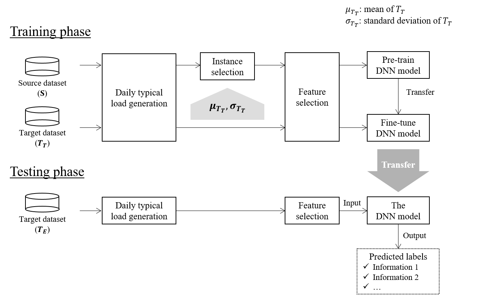

# Inferring Socio-Demographic Information Using Smart Meter Data by Transfer Learning

This repository is the official implementation of Inferring Socio-Demographic Information Using Smart Meter Data by Transfer Learning.  
You can find the paper here:
[link](https://ieeexplore.ieee.org/document/9791982)


Introduction
=======================================
* This paper proposes a framework for inferring socio-demographic information using smart meter data
* Collecting household characteristics information and corresponding smart meter data requires considerable effort and cost
* We present a transfer learning methodology using datasets collected from different areas

Usage
==================
### Dataset
Download following datasets  
`SAVE Dataset`: [link](https://beta.ukdataservice.ac.uk/datacatalogue/doi/?id=8676#1)  
`CER Dataset`: [link](http://www.ucd.ie/issda/data/commissionforenergyregulationcer/)

Data location should be like belows
```
.
|- data
    |- CER
        |- power.csv
        |- Smart meters Residential pre-trial survey data.csv
    |- SAVE
        |- power.csv
        |- save_household_survey_data_v0-3.csv
```

### Install
```
pip install -r requirements.txt
```


### Preprocessing
Make label dataset
```
python preprocessing/make-cer-label.py
python preprocessing/make-save-label.py
```


### Train and Evaluate
```
python main.py
```

Methodology
=======================================


### 1. Daily typical load generation
From time series dataset, get daily typical load by removing untypical sample
### 2. Instance selection
To prevent negative transfer remove instance which reduce similarity between two datasets by measuring [KL divergence](https://en.wikipedia.org/wiki/Kullback%E2%80%93Leibler_divergence)
### 3. Feature selection
Extract influential features for both Source and Target datasets to remove noisy feature by [mrmr](https://pypi.org/project/pymrmr/)
### 4. Training
Train deep learning model with the source dataset
### 5. Fine tuning
Train the pre-trained model with target dataset
### 6. Testing
Infer test dataset with the rest of target dataset

Benchmarking
=======================================
Compare our methodology with benchmarking methodologys in the face of a shortage of datasets

1. @ paper:
Wang, Yi, et al. 
"Deep learning-based socio-demographic information identification from smart meter data."
IEEE Transactions on Smart Grid 10.3 (2018): 2593-2602.  
2. @ paper:
Yan, Siqing, et al. 
"Time–Frequency Feature Combination Based Household Characteristic Identification Approach Using Smart Meter Data." 
IEEE Transactions on Industry Applications 56.3 (2020): 2251-2262.
```
python benchmarking.py
python benchmarking-2.py
```

Contact
==================
If there is something wrong or you have any questions, send me an [](mailto:pond9816@gmail.com) or make an issue.  
